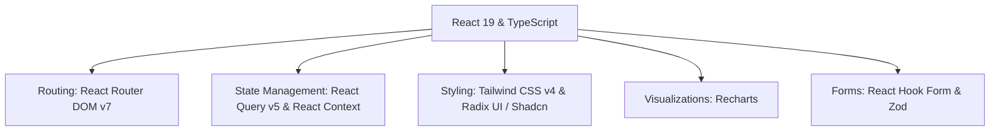

# Sejajar Creative


**The ultimate collaborative workspace and dashboard for creative agencies, production workflows, and social media management.**


---

## 🌟 Overview

**Sejajar Creative** is a next-generation web application designed to bridge the gap between clients, managers, writers, editors, and social media administrators. It provides a cohesive, secure environment for managing content from initial script drafting and client contract scoping up to media upload, publishing, and engagement analytics.

Built on a modern frontend stack using **React 19**, **Vite**, **TypeScript**, and **Tailwind CSS v4.0**, the interface delivers custom dashboard spaces and workflows tailored to each member's specific organizational role.

---

## ✨ Features

The application incorporates a rich suite of collaborative modules:

- 📊 **Unified Dashboard**: Custom widgets, summaries, and real-time operational graphs depending on user identity.
- 📑 **Contract Management**: Seamless scoping of client contracts, active contracts monitoring, and deliverables tracking.
- 👥 **Client Relations Directory**: Hub for managing external client accounts, communications, and historical engagement.
- 📋 **Interactive Kanban Task Board**: Task progression tracker featuring transitions from draft ideas, review stages, and publication queues.
- 📅 **Visual Content Calendar**: Fully-interactive calendar showing upcoming production deadlines and scheduling publications across platforms.
- 📝 **Draft Sandbox**: Tailored writing interfaces for scriptwriters and copywriters to edit and format copy.
- 📤 **Media Assets & Uploads**: Workspace for video and graphic editors to upload drafts and high-definition assets.
- 🚀 **Publishing Pipeline**: Command center to queue, format, and push approved creative assets to digital platforms.
- 📈 **Analytics & Engagement Metrics**: Detailed charts (donut, bar, line) evaluating post performance, engagement, views, and reach.
- 🛡️ **Role-Based Access Control (RBAC)**: Fine-grained permissions dashboard mapping roles to specific application sections.
- 🪵 **Audit Trails & System Logs**: Operational database records, audit trails, and tracking logs for system monitoring.

---

## 👥 Role-Based Personas

Sejajar Creative structures permissions around specific organizational roles to streamline workspace operations:

| Icon | Role Name | Primary Responsibility | Section Permissions |
| :---: | :--- | :--- | :--- |
| 👑 | **Super Admin** | Platform security, system maintenance, and user lifecycle. | User & Roles, System Logs, Dashboard, Settings |
| 💼 | **Owner** | High-level operations monitoring, financial/contract approvals, and analytics. | Dashboard, Contracts, Analytics, Team, Settings |
| 🎯 | **Content Lead** | Workflow scoping, content plan strategies, client relations, and task assignments. | Dashboard, Contracts, Content Plan, Tasks, Schedule, Analytics, Settings |
| ✍️ | **Script Writer** | Writing and revising script copy, tracking content drafts. | Dashboard, Content Plan, Tasks, Drafts, Settings |
| 🎬 | **Editor** | Media file manipulation, visual rendering, asset uploads, and deliverables matching. | Dashboard, Content Plan, Tasks, Uploads, Settings |
| 📢 | **Admin Social Media** | Scheduling calendar publications, distribution channels, and audience engagement tracking. | Dashboard, Content Plan, Tasks, Calendar, Publish, Engagement, Settings |

---

## 🛠️ Technology Stack



### Core Technologies

- **UI Framework**: [React 19](https://react.dev/) & [TypeScript](https://www.typescriptlang.org/) for type safety and component-driven architecture.
- **Build Tool**: [Vite 8](https://vitejs.dev/) for extremely fast hot module replacement (HMR) and production builds.
- **Styling System**: [Tailwind CSS v4.0](https://tailwindcss.com/) with native OKLCH theme variables and CSS-based configuration.
- **Component Libraries**: [Radix UI primitives](https://www.radix-ui.com/) and [Shadcn UI](https://ui.shadcn.com/) custom-styled tokens.
- **Interactive Visualizations**: [Recharts](https://recharts.org/) for beautiful responsive dashboards.
- **Form Verification**: [React Hook Form](https://react-hook-form.com/) integrated with [Zod](https://zod.dev/) schemas.
- **Data Queries**: [TanStack Query v5](https://tanstack.com/query) for caching and network requests logic.

---

## 📁 Directory Structure

```text
react-sejajar/
├── public/                 # Static assets, icons, and favicons
└── src/
    ├── app/                # Main router, providers, and bootstrap configuration
    ├── assets/             # Logos, images, and global CSS stylesheets
    │   ├── logos/          # Sejajar brand SVG logos (DashboardLogo, loginLogo)
    │   └── styles/         # tailwindcss directives and system tokens (globals.css)
    ├── components/         # Highly reusable shared UI elements (Button, Card, Notification, etc.)
    ├── contexts/           # Authentication, Theme, and Notifications React Context providers
    ├── features/           # Feature modules (analytics, auth, clients, tasks, etc.)
    │   └── [feature_name]/
    │       ├── components/ # Local component tree
    │       ├── data/       # Mock data and structural interfaces
    │       └── pages/      # Route entry points
    ├── hooks/              # Global custom hooks
    ├── layouts/            # Top-level shell views (DashboardLayout, AuthLayout)
    ├── lib/                # Third-party utilities (shadcn components config, axios clients)
    ├── routes/             # Route guards and authorization barriers
    ├── services/           # Backend API connector wrappers
    └── utils/              # Generic utility formatting and calculations
```

---

## 🚀 Getting Started

Follow the instructions below to set up and run the frontend client application locally.

### 📋 Prerequisites

Ensure you have the following installed on your machine:

- **Node.js** (version `v18.x` or later recommended)
- **npm** (version `v9.x` or later)

---

### 📥 Installation & Setup

1. **Clone and navigate to the project directory**:

   ```bash
   git clone https://github.com/YourUsername/react-sejajar.git
   cd react-sejajar
   ```

2. **Install package dependencies**:

   ```bash
   npm install
   ```

3. **Configure Environment Variables**:

   Create a `.env` file in the root directory:

   ```env
   VITE_API_URL=http://localhost:3000
   ```

   > [!NOTE]
   > `VITE_API_URL` should point to your active local backend API instance. Refer to the backend repository documentation for instructions on setting up the API.

4. **Start the Development Server**:

   ```bash
   npm run dev
   ```

   The application will compile and start locally. You can access it in your browser at [http://localhost:5173](http://localhost:5173).

---

### 💻 Scripts & Commands Reference

| Command | Action |
| :--- | :--- |
| `npm run dev` | Launch local Vite development server on [http://localhost:5173](http://localhost:5173). |
| `npm run build` | Compile TypeScript and bundle production files in `/dist` folder. |
| `npm run preview` | Run the compiled production build locally for verification. |
| `npm run lint` | Inspect code style, formatting, and syntax errors using ESLint. |
| `npx tsc --noEmit` | Validate type-safety using the TypeScript compiler. |

---

## 🎨 Theme & Colors

Sejajar Creative utilizes Tailwind CSS v4's custom theme properties matching the brand identity:

- **Red Accent (Logo)**: `#AB1313` (`--color-red-logo`)
- **Light Theme**: Bright, minimal layout with subtle gray and slate accents (`oklch(1 0 0)` background).
- **Dark Theme**: Deep, high-contrast UI tailored for low-light content creation sessions (`oklch(0.145 0 0)` background).

The styles are configured directly inside [globals.css](file:///c:/laragon/www/react-sejajar/src/assets/styles/globals.css) using CSS layers and custom Tailwind theme tokens.

---

## 🤝 Contribution Guidelines

1. **Create a Feature Branch**: `git checkout -b feature/AmazingFeature`
2. **Commit Your Changes**: `git commit -m 'Add some AmazingFeature'`
3. **Push to Branch**: `git push origin feature/AmazingFeature`
4. **Open a Pull Request**: Submit a PR to the `develop` branch for review.

---

Developed by the **Sejajar Creative Team**.
